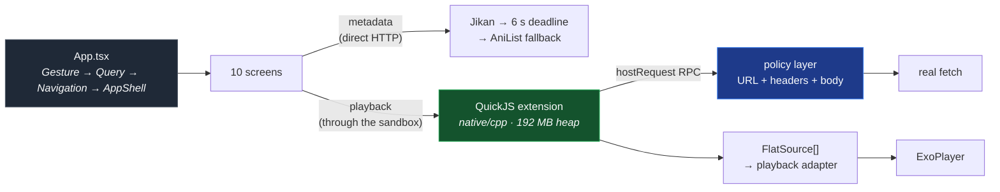

<div align="center">


# pixiAndroid

**Your anime library, natively on Android.**

No WebView, no tab strip, no waiting — a fast, extension-powered player that
resumes exactly where you left off.

[](https://github.com/pixiAnime/pixiAndroid/releases/latest)


`React Native 0.87` `New Architecture` `Hermes` `ExoPlayer` `QuickJS` `Kotlin`

[Download the APK](https://github.com/pixiAnime/pixiAndroid/releases/latest) ·
[Build it yourself](#-build-from-source) ·
[How it works](#-architecture)

</div>

---

## What is this?

pixiAndroid is the native Android client for PixiAnime — the sibling of
[pixiWeb](https://github.com/pixiAnime/pixiWeb) (the web app) and
[pixiDesktop](https://github.com/pixiAnime/pixiDesktop) (the Tauri shell).

**52 of its source files are synced byte-for-byte from `pixiWeb`**, so the three
clients share one business logic by construction rather than by copy-paste.
Everything else is Android-only: the sandbox, the player, the storage layer.

## Highlights

| | |
| --- | --- |
| 🧩 **Extensions** | The same extensions as the web app install from a URL and run inside an in-app QuickJS sandbox — no network access, no host access, every request passes through the app's policy layer. |
| ▶️ **A real player** | ExoPlayer under RN controls: scrub, skip 5/10/15/30 s, speed 0.5×–2×, fit/fill, audio track, sleep timer, picture-in-picture, auto-play next episode. |
| 💬 **Subtitles** | Container *and* side-loaded tracks, with size and delay control. Set the app language to **Türkçe** and Turkish picks itself; a track you tap stays picked. English, Russian and Turkish ship in the box. |
| ⏯️ **Resume** | Reopen an episode and it is **paused at the saved second** — never mid-sentence. |
| 📱 **Gestures** | YouTube's set: tap for controls, double tap to seek, hold for 2×. A stray tap never pauses your film. |
| 🗂️ **Your library** | History, My List, progress and settings live on-device (MMKV) and survive restarts, offline and all. |
| 🌍 **Three languages** | English, Русский, Türkçe — with per-track subtitle auto-pick that follows your choice. |

### Gesture cheat sheet

| Gesture | Does |
| --- | --- |
| Tap the picture | Show / hide controls (never play or pause) |
| Double tap left / right | Seek ∓ / ± by your skip distance |
| Press and hold | Play at 1.5× / 2× / 3× while held |
| 🖥 button | True fullscreen, no black frame, back exits fullscreen first |

## 📦 Architecture

Two data paths leave the pages, and they do not touch each other.



- **Chrome lives above the navigator.** `AppShell` renders the header, the outlet and
  the bottom nav as *siblings* of the `Stack.Navigator`, so a tab switch never remounts
  the chrome. It feels like Android, not a web page.
- **The sandbox is the only door to a source.** An extension cannot reach a socket. It
  calls `context.http.*`, which becomes a `hostRequest` event, goes through
  `runtime/policy.ts`, and returns plain text. The module loader throws a
  `ReferenceError` for any import except `pixi:extension`.
- **One worker thread, bounded.** Every extension gets its own `JSRuntime` on a single
  native worker thread, with a 192 MB heap, a 512 KB stack and boot/idle deadlines.
  A timeout disposes and recycles the context.
- **Requests have a deadline.** Metadata that does not answer within **6 s** is cut
  over to AniList rather than stalling the screen.
- **Lists are windowed.** History and My List render the rows on screen, not every
  poster you own.

The full internals — sandbox limits, the player settings tree, fullscreen promotion —
live in [`docs/ARCHITECTURE.md`](docs/ARCHITECTURE.md).

## 📲 Install

1. Grab **`pixiAndroid-vX.Y.Z.apk`** from the
   [latest release](https://github.com/pixiAnime/pixiAndroid/releases/latest).
2. Open it and allow *Install unknown apps* for your file manager or browser.
3. Install, open, pick an extension URL — done.

Updates arrive the same way: a new release APK installs right over the old one,
keeping your history, list, settings and progress.

## 🛠 Build from source

pixiAndroid syncs from `pixiWeb`, so clone the siblings side by side:

```bash
git clone https://github.com/pixiAnime/pixiAndroid.git
git clone https://github.com/pixiAnime/pixiWeb.git ../pixiWeb
cd pixiAndroid
npm ci
npm run android          # debug build on a connected device / emulator
```

### Prerequisites

| | Requirement |
| --- | --- |
| Node | `>= 22.11` — enforced by `engines` in `package.json` |
| Package manager | **npm** — this repo uses `package-lock.json`, not pnpm |
| JDK | 21 (what CI uses) |
| Android SDK | compileSdk 37, targetSdk 36, minSdk 24, build-tools 37.0.0 |
| NDK / CMake | `27.1.12297006` / `3.22.1` — for the QuickJS native module |

## Development

| Script | Does |
| --- | --- |
| `npm start` | Metro bundler |
| `npm run android` | Build + install the debug app on a device or emulator |
| `npm run build:debug` | `./gradlew assembleDebug` |
| `npm run build:release` | `./gradlew assembleRelease` → `android/app/build/outputs/apk/release/app-release.apk` |
| `npm run verify` | **The whole gate** — see below |
| `npm run sync:check` | Fail if any of the 52 shared files drift from `pixiWeb` |
| `npm run compat` | Prove every extension is self-contained ESM with contract parity |
| `npm run test` | 143 tests via the Node test runner |
| `npm run lint` · `npm run typecheck` | ESLint · `tsc --noEmit` |

`npm run verify` runs, in order: shared-file sync, sandbox polyfills, extension
fixtures, typecheck, lint, extension compatibility, then the tests. It is the
command to run before you push:

```bash
npm run verify
# sync-shared: OK — 52 shared file(s) in sync with pixiWeb
# OK — 7 extension(s) compatible, contract parity holds.
# ℹ tests 143  ℹ pass 143  ℹ fail 0
```

A release build is roughly **61 MB** (58 MiB), R8-shrunk to a single 4.6 MB
`classes.dex`, shipping only the ABIs people actually run
(`arm64-v8a`, `armeabi-v7a`, `x86_64` for emulators).

### Release signing

`assembleRelease` signs with the key named in `android/keystore.properties`
(gitignored — **never commit it**), or with the committed debug key when that file
is absent, so a plain build still produces an installable APK that upgrades over a
local debug build.

For CI, publish the same values as repository secrets:

```bash
gh secret set RELEASE_KEYSTORE_B64 --body "$(base64 -w0 android/app/release.keystore)"
gh secret set RELEASE_STORE_PASSWORD   # store / key passwords from keystore.properties
gh secret set RELEASE_KEY_ALIAS --body pixi
gh secret set RELEASE_KEY_PASSWORD
```

> ⚠️ Back the keystore up somewhere safe. Losing it means you can never update an
> installed copy — Android refuses the signature.

## 📤 Releases

Push a `v*` tag (or run the **Release** workflow by hand) and the APK is built and
published as a GitHub Release named `pixiAndroid-vX.Y.Z.apk`.

The workflow installs the pinned NDK and CMake, runs `npm ci`, unpacks the release
key from `RELEASE_KEYSTORE_B64` when present, and runs `assembleRelease`. Without
the signing secrets it still produces an APK — signed with the debug key.

## Repository layout

```text
pixiAndroid/
├── App.tsx · index.js       # entry; index.js installs storage globals first
├── android/                 # Gradle project (app + pixiquickjs module)
├── native/                  # C++ QuickJS sandbox + Kotlin bridge
├── src/
│   ├── api/                 # jikan / anilist / deadline / fallback
│   ├── extensions/          # SDK, runtime, providers, policy layer
│   ├── platform/            # quickjs bridge, mmkv storage, fullscreen
│   ├── components/ · pages/ · navigation/ · hooks/ · i18n/
├── scripts/                 # sync-shared, compat, polyfills, fixtures, hls-proxy
├── tests/                   # 18 files · node --test
└── shared-manifest.json     # the 52 files owned by pixiWeb
```

## Security model

The extension runtime is treated as **hostile input**. An extension is arbitrary
JavaScript from a URL a user typed, so it gets a sandbox with no ambient authority:

- **No network primitives.** `fetch`, `XMLHttpRequest`, `WebSocket`, `EventSource`,
  `RTCPeerConnection`, `Worker` and `importScripts` are pinned to `undefined`,
  non-writable and non-configurable.
- **No host access.** The native module loader throws a `ReferenceError` for any
  specifier other than `pixi:extension`.
- **Every request is inspected.** Host calls funnel through one door that validates
  the URL, sanitizes headers and body, and enforces size caps.
- **Bounded by construction.** Per-extension heap, stack, boot and idle deadlines on
  a single worker thread; a hung extension is disposed, not waited on.
- **Signed APKs only come from CI.** Nothing else can update an installed copy.

## Known limitations

These are deliberate, documented ceilings — not open bugs:

- **No CI on pull requests.** The only workflow is the tag-triggered release build,
  and it does **not** run `npm run verify`. Drift in the 52 shared files or a broken
  test will not block a merge — run `npm run verify` locally before you push.
- **Resume resets near the ends.** Under 5 seconds in, or at/above 95 % watched,
  resume starts from zero rather than seeking into the credits.
- **The 6 s deadline is the metadata path only.** AniList has a 12 s budget and
  extension HTTP/exec have 15 s / 20 s.
- **Unsigned APKs from CI without secrets.** Configure the `RELEASE_*` secrets or
  every published APK is debug-signed.

## ⚠️ Disclaimer

pixiAndroid hosts no media. Everything it plays comes from extensions you install
yourself; the app only fetches, decodes and shows what those sources serve. You are
responsible for what you point it at.

---

<div align="center">
<sub>Built with React Native, ExoPlayer and a C++ sandbox that never opens a socket.</sub>
</div>